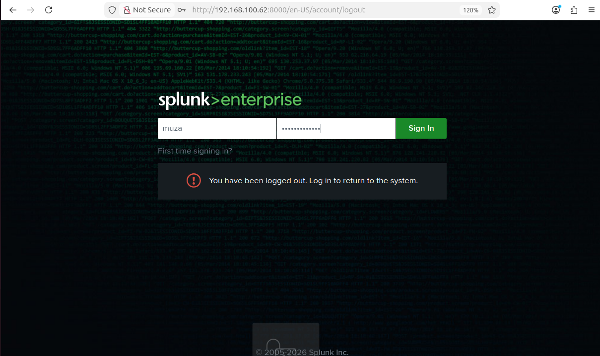
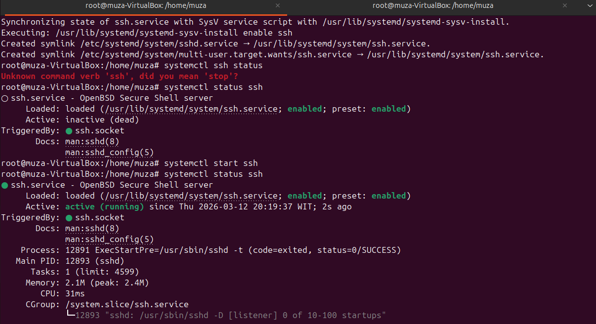
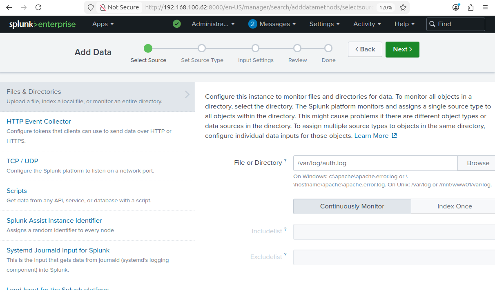
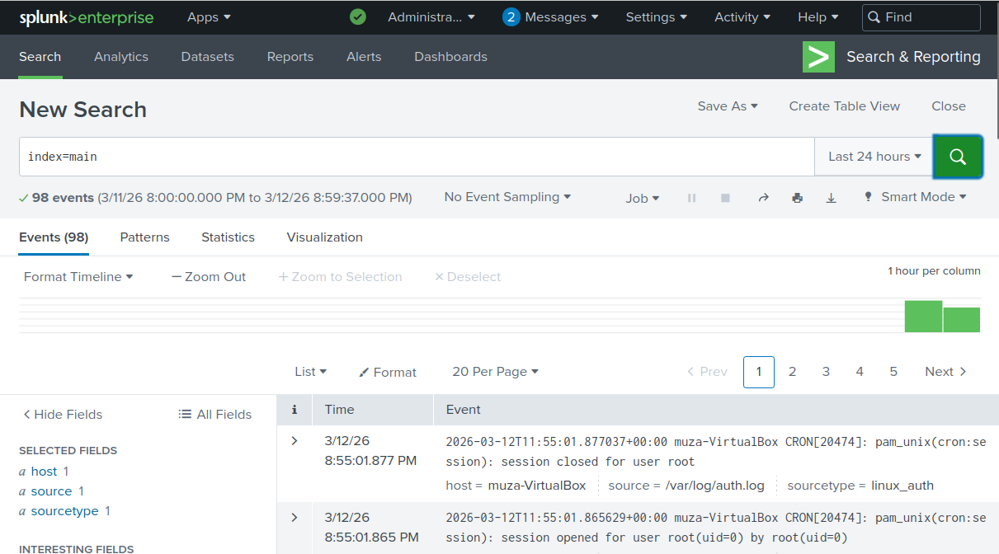
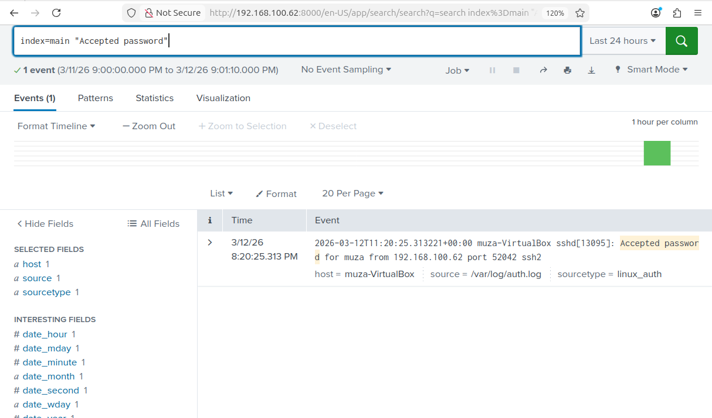
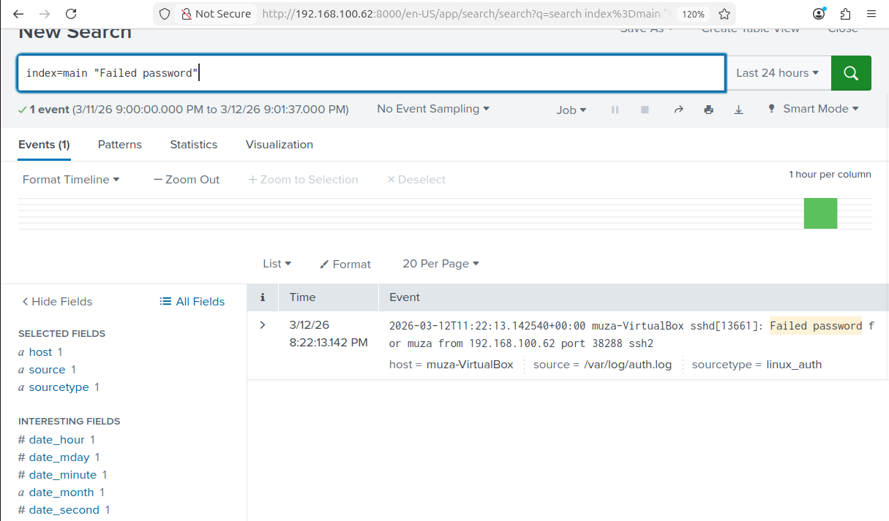

# Splunk SIEM Lab – Monitoring Log Autentikasi Linux

## Overview

Project ini merupakan simulasi **Security Information and Event Management (SIEM)** menggunakan Splunk Enterprise untuk memonitor log autentikasi dari server Linux.

Tujuan dari lab ini adalah untuk memahami bagaimana **Security Operations Center (SOC)** mengumpulkan, memonitor, dan menganalisis log keamanan untuk mendeteksi aktivitas mencurigakan seperti percobaan login SSH gagal atau potensi serangan brute force.

---

## Lingkungan Lab

| Komponen      | Teknologi         |
| ------------- | ----------------- |
| SIEM          | Splunk Enterprise |
| Server Target | Ubuntu Server     |
| Virtualisasi  | Oracle VirtualBox |
| Sumber Log    | /var/log/auth.log |

---

## Arsitektur Sistem

Aktivitas User → Log Autentikasi Linux → Splunk SIEM → Analisis Keamanan


---

## 1. Instalasi Splunk Enterprise

Download Splunk:

```bash
wget https://download.splunk.com/products/splunk/releases/<version>/linux/splunk-<version>-Linux-x86_64.tgz
```

Ekstrak file dan pindahkan ke `/opt`:

```bash
tar -xvzf splunk-<version>-Linux-x86_64.tgz
sudo mv splunk /opt/
```

Menjalankan Splunk:

```bash
cd /opt/splunk/bin
sudo ./splunk start
```

Akses dashboard Splunk melalui browser:

```
http://SERVER_IP:8000
```



---

## 2. Instalasi SSH Server

Install SSH server pada Ubuntu:

```bash
sudo apt update
sudo apt install openssh-server -y
```

Menjalankan service SSH:

```bash
sudo systemctl start ssh
sudo systemctl enable ssh
```

Memastikan service SSH berjalan:

```bash
sudo systemctl status ssh
```



---

## 3. Mengirim Log Autentikasi ke Splunk

Masuk ke dashboard Splunk kemudian:

Settings → Add Data → Monitor → Files & Directories

Tambahkan path log berikut:

```
/var/log/auth.log
```

Set **Source Type**:

```
syslog atau Linux_secure
```

Set **Index**:

```
main
```

Kemudian submit konfigurasi.




---

## 4. Verifikasi Log Masuk ke Splunk

Jalankan query berikut di menu **Search & Reporting**:

```spl
index=main
```

Jika konfigurasi berhasil, log autentikasi Linux akan muncul di Splunk.




---

## 5. Mendeteksi Login SSH Berhasil

Query untuk melihat login SSH yang berhasil:

```spl
index=main "Accepted password"
```

Contoh log:

```
Accepted password for muza from 192.168.100.62
```




---

## 6. Mendeteksi Login SSH Gagal

Query untuk melihat percobaan login gagal:

```spl
index=main "Failed password"
```

Contoh log:

```
Failed password for muza from 192.168.100.62
```




---

## 7. Deteksi Potensi Serangan Brute Force

Query berikut digunakan untuk melihat IP yang melakukan percobaan login paling banyak:

```spl
index=main "Failed password"
| stats count by src_ip
| sort -count
```

Query ini membantu mengidentifikasi IP address yang melakukan percobaan login berulang.


---

## Use Case Monitoring Keamanan

Lab ini mensimulasikan aktivitas yang biasanya dilakukan oleh **SOC Analyst**, seperti:

* memonitor log autentikasi server
* mendeteksi percobaan brute force login
* menganalisis aktivitas login yang mencurigakan
* mengidentifikasi IP address yang berpotensi sebagai attacker

---

## Pengembangan Selanjutnya

Beberapa pengembangan yang akan dilakukan pada lab ini:

* simulasi mesin attacker menggunakan Kali Linux
* simulasi serangan brute force SSH
* deteksi aktivitas port scanning
* pembuatan dashboard monitoring di Splunk
* pembuatan alert otomatis ketika terjadi aktivitas mencurigakan

---

## Skill yang Dipelajari

Melalui lab ini, beberapa skill yang dipelajari antara lain:

* Deploy SIEM
* Monitoring log Linux
* Analisis event keamanan
* Penggunaan Splunk SPL (Search Processing Language)
* Workflow investigasi SOC

---

## Author

Muza
Mahasiswa Teknik Komputer – Fokus Cyber Security
